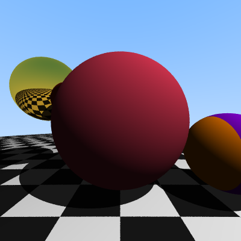
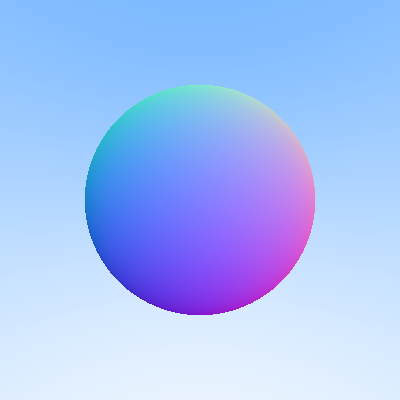
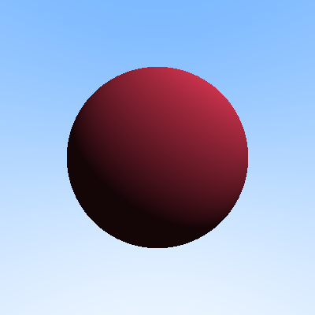
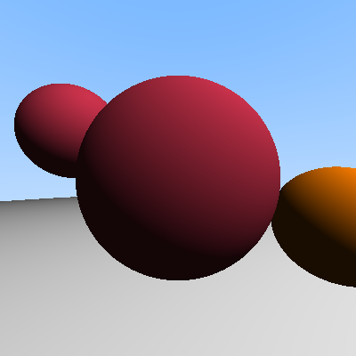
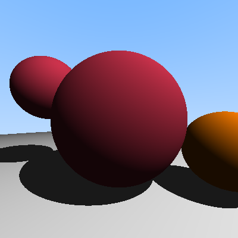
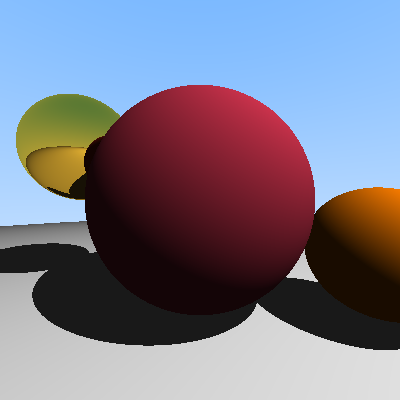

# C++ Ray Tracer

A feature-rich ray tracer built from scratch in C++ to demonstrate computer graphics programming, mathematical foundations, and software architecture skills.


*Current implementation with all features active. Procedural textures (checkerboard ground, striped sphere)*

## Overview

This project implements a physically-based ray tracer capable of rendering 3D scenes with realistic lighting, shadows, reflections, and textures. Built without external graphics libraries, it showcases a deep understanding of:

- 3D vector mathematics and linear algebra
- Ray-object intersection algorithms
- Light transport and shading models
- Object-oriented design patterns
- Recursive ray tracing for reflections

## Features

- **Core Ray Tracing Engine**
  - Ray-sphere intersection using quadratic equations
  - Extensible object system supporting multiple geometry types
  - Efficient scene management with closest-hit detection

- **Lighting & Shading**
  - Lambertian (diffuse) shading model
  - Point light sources with colour and intensity
  - Shadow rays for realistic shadowing
  - Ambient lighting to prevent completely black shadows

- **Materials System**
  - Diffuse (matte) materials
  - Reflective (metal) materials with recursive ray bouncing
  - Material-based colour and surface properties

- **Textures**
  - Procedural textures (checkerboard, stripes, solid colours)
  - Position-based texture mapping

- **Anti-Aliasing**
  - Stochastic sampling with configurable samples per pixel
  - Smooth edges and reduced aliasing artifacts

## Feature Progression

This project was built incrementally, with each feature building on the previous foundation:

### Stage 1: Gradient Background

*Basic rendering pipeline with sky gradient*

### Stage 2: Sphere with Normal Visualization

*Ray-sphere intersection with surface normals mapped to colours*

### Stage 3: Diffuse Lighting

*Single sphere with Lambertian shading from a point light*

### Stage 4: Multiple Objects

*Scene system supporting multiple objects with proper occlusion*

### Stage 5: Shadows

*Shadow rays creating realistic cast shadows*

### Stage 6: Reflective Materials

*Metal materials with recursive ray tracing for reflections*

### Stage 7: Anti-Aliasing

*Stochastic sampling for smooth edges*

### Stage 8: Textures

*Procedural textures (checkerboard ground, striped sphere)*

## Technical Architecture

### Core Components

**vec3.h** - 3D vector mathematics foundation
- Vector arithmetic operations
- Dot product and cross product
- Normalization and length calculations
- Random vector generation

**ray.h** - Ray representation
- Origin point and direction vector
- Parametric ray equation: P(t) = origin + t * direction

**hittable.h** - Abstract geometry interface
- Base class for all scene objects
- Hit testing with t-range validation
- Hit record with intersection data

**sphere.h** - Sphere geometry implementation
- Quadratic equation solving for ray-sphere intersection
- Surface normal calculation
- Material assignment

**scene.h** - Scene management
- Collection of hittable objects
- Closest-hit detection across all objects

**material.h** - Material system
- Lambertian (diffuse) material
- Metal (reflective) material
- Scatter direction calculation

**texture.h** - Texture system
- Solid colour textures
- Procedural checkerboard pattern
- Procedural stripe pattern

**light.h** - Lighting calculations
- Point light representation
- Diffuse (Lambertian) shading calculation
- Shadow integration

**color.h** - Colour handling
- RGB colour representation
- Colour output to PPM format

## Building and Running

### Prerequisites
- C++17 compatible compiler
- CMake 3.20 or higher
- Visual Studio 2019+ (Windows) or equivalent IDE

### Build Instructions
```bash
# Clone the repository
git clone https://github.com/myszkov/raytracer.git
cd raytracer

# Create build directory
mkdir build
cd build

# Configure and build
cmake ..
cmake --build .

# Run
./RayTracer
```

### Output
The program generates a PPM image file (`output.ppm`) which can be viewed in:
- Modern web browsers (Chrome, Firefox)
- Image viewers supporting PPM format
- Converted to PNG/JPG using image processing tools

## Configuration

Key parameters in `main.cpp`:
```cpp
const int image_width = 400;        // Output image width
const int image_height = 400;       // Output image height
const int samples_per_pixel = 16;   // Anti-aliasing sample count
const int max_depth = 10;           // Maximum ray bounce depth
```

## Future Enhancements

Potential features for continued development:
- Triangle meshes for complex geometry
- Refractive materials (glass, water)
- Camera positioning and orientation controls
- Image-based textures
- Acceleration structures (BVH) for performance
- Global illumination techniques
- Path tracing for physically accurate rendering

## Learning Resources

This project was built following ray tracing fundamentals from:
- "Ray Tracing in One Weekend" by Peter Shirley
- Computer graphics textbooks and papers
- Experimentation and iterative development

## Showcase Mode

The project includes a showcase mode for demonstrating feature progression. To generate progression images:

1. Edit `CMakeLists.txt` to use `stages/showcase_main.cpp`
2. Toggle feature flags in the showcase file
3. Render each stage with appropriate output filename
4. Document progression in README

## License

This project is available for educational purposes and portfolio demonstration.

## Contact

Viktor Myszko
viktor.myszko@gmail.com
github.com/myszkov

---

*Built as a portfolio project to demonstrate C++ programming, computer graphics knowledge, and software engineering practices.*